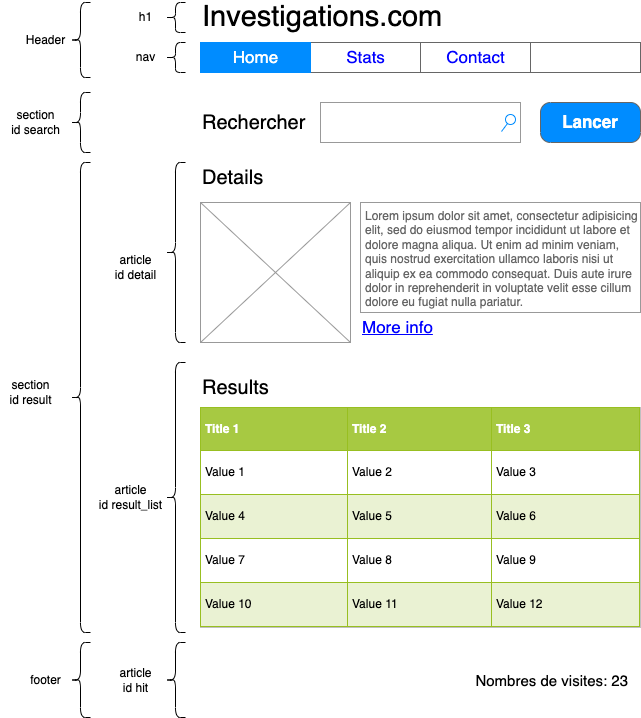

# webdev Level 1 (Vanilla Days!)

Basics of web development

# Goal

Goal is build a small search engine across the Metropolitan Museum of Art of New-York

A user should be able to perform:

- Choose a department in a combobox
- Check a combobox to choose only result with "On view in museum"
- Type a keyword in in a field
- Click to run an online search
- Show results in a table or "No Result" 
- Click on detail icon which is on each line
- See the details on the page 

You should to be able to:

- Know about the usage of your site by tacking and display statistics

Good luck, I will enjoy my coffee while you work hard ;)

# Steps

## 1 - Build your requests with POSTMAN

First approach is prepare a little bit your data exchange. This way you can ask questions early in the project and probably fix isssues, and avoid misunderstanding with your customer.

### Expected result

Build collections in POSTMAN with samples requests. You will need request to:

Collection museum:

API is available at https://metmuseum.github.io/

- List departments
- Search object with a keywork by department or not
- Filtering by visible object at museum
- Filtering by result with image only 
- Get detail of an object

Collection visits:

API is available at https://countapi.xyz/#format

- Get/Hit the number of visit on your home page
- Get/hit the number of search on your site
- Get/hit the total number of click on detail 
- Get info on those hits
### Tips & help

- Begin by the simpliest request the API can do
- Give a id to your request to quickly identify the difficulty, or a logical order (e.g. 1 Get all products)

## 2 - Build your web page from scratch

Now it's time to have a first static mock. It's not the last version you will build so don't spend all your energy with styling. Keep this KISS (Keep It Simple Stupid).

### Expected result

Have a static HTML home page with future components. It's a kind of mock that we can validate with the customer and make it dynamic and styled later on.

### mockup

This is a sample of page structure you can begin with

### Tips & help

- You can find info on page structure on [alsacreation](https://www.alsacreations.com/article/lire/1376-html5-section-article-nav-header-footer-aside.html)
- First, stay focus on feature and content, not design. When your feature work, begin to make this beautiful :)
- Colors in mock above have been arbitrary choosen 

## 3 - Implement the search form

Now let's put peaces together. Let's begin to make things dynamic by implementing the first request in HMTL/JavaScript

### Expected result

- A click on search trigger a call to the API
- The result is displayed in the JavaScript console in a raw format

### Tips & help

- Click on the button has no effect until the user type something in the search field
- Make a JavaScript file home.js and call it in the bottom of your page
- JavaScript has a function fetch() that could be useful ;)
- console.log() allow you to display things in the web dev console of the browser

## 4 - Display result in the table

Now it's time to let the user show the result of his search. the body of the table will be now changed to be built with JavaScript

### Expected result

JavaScript use the result and for each element must create a row for the table 

### Tips & help

- Give an "id" to your table to be able to handle it with JavaScript
- JavaScript is able to build HTML element or inject HTML syntax in the page. You can choose the method you prefer (it's better to use JavaScript function to build HTML but it's harder to handle when you begin)
- Think about cleaning your table between searches

## 5 - Implement the details zone

Let's your engine to be more powerful by adding a link to disploy more details on a row.

### Expected result

- When user click on a link in the row, the site make a new HTTP request to get details on the item
- The details are used to fill the details section

### Tips & help

- JavaScript has feature to hide / disploy a HTML portion thanks to CSS, could be an improvement to disploy only when result comes.

## 6 - Add counters on your site

### Expected feature

The counters must track:

- How many times the home page was visisted
- How many search user done
- How many times user decide to show the detail (whatever it is)

### Tips & help

- Use the online free hit API: https://countapi.xyz/#format
- Reminder : Postman is your friend to discover and play without UI drawbacks

## 7 - Create a new page for statistics and put the link in the home page

### Expected feature

Anybody can access to a page stats.html. This page show the statistics of your site (visits, search, details) as a table.

### mockup

### Tips & help

Use https://countapi.xyz/#format

- The main difference with the previous step is that all requests on this page don't hit the counters, it's only info
- Prefer to use XHR/fetch or JQuery method (For JQuery, you need to declare jQuery first)

## 8 - Want more? Most visited details

Change the HTML table of hot visit by a graph.

# Resources

Create a HTML form: https://developer.mozilla.org/fr/docs/Web/HTML/Element/form
Make request with javascript level 1: https://www.pierre-giraud.com/javascript-apprendre-coder-cours/api-fetch/
Make request with javascript level 2: https://developer.mozilla.org/fr/docs/Web/API/Fetch_API/Using_Fetch
Javascript, for loop: https://developer.mozilla.org/en-US/docs/Web/JavaScript/Reference/Statements/for...of
Javascript, JSON arrays (advanced): https://www.sitepoint.com/loop-through-json-response-javascript/
Javascript, playground: https://developer.mozilla.org/en-US/docs/Web/JavaScript/Reference/Statements
HTML Avoid to post a form: https://stackoverflow.com/questions/2825856/html-button-to-not-submit-form

