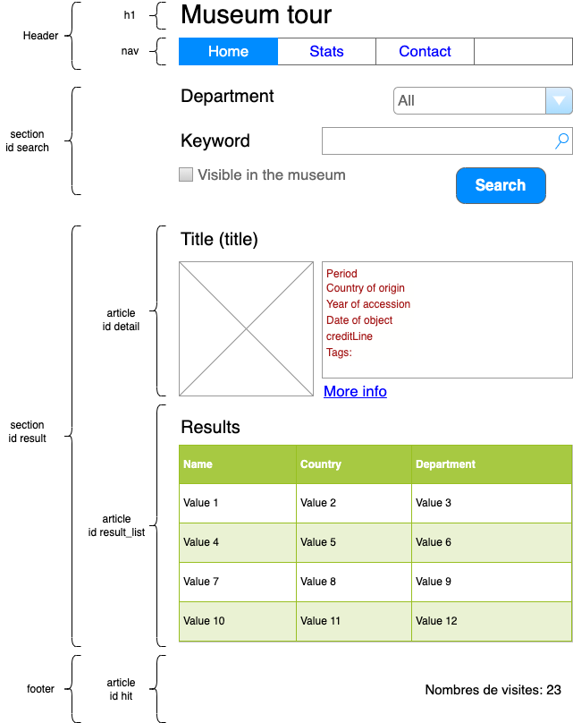

# webdev Level 1 (Vanilla Days!)

Basics of web development

# Goal

Goal is to build a small search engine across the Metropolitan Museum of Art of New-York objects.

Your application allows users to look for in the museum database with a small search form and show information and pictures of them.

As a user, you should be able to perform:

- Choose a department
- Choose if you wants only result with "On view in museum" (checkbox)
- Type a keyword in in a field (e.g. sarcophagus)
- Click to search
- Show results in a table
- Click on detail on each line
- See the details of the selected objects

As a administrator, You should to be able to:

- Show statistics about usage of your site

To acheive this, 3 steps:

1. Understand and build test API suites with POSTMAN
2. Make a static web page
3. Make this page dynamic by using JavaScript and API call based on test suite

# Step 1 - Build your requests with POSTMAN (2h)

## Goal

- Understand how the API works (could be very complex)
- Know if your are able to perform required requests on the API
- Have several samples to use when you need to call the API in a application

## Expected result

Build 2 collections in POSTMAN with samples requests:

- "Museum" with API https://metmuseum.github.io/
- "Visits" with API https://countapi.xyz/#format

## Collection "Museum"

API documentation is available at https://metmuseum.github.io/

Make 4 requests:

- Get a list of departments ID (/departments endpoint)
- Search object with a keywork by department ID (/search endpoint)
- Search object with a keywork by department ID and Add criteria to get only "visible object in museum" and image only (/search endpoint)
- Get detail of an object (/objects/{objectID} endpoint)

## Collection "visits"

API documentation is available at https://countapi.xyz/#format

Make 4 resquests:

- Get/Hit the number of "visit" on your home page (/hit endpoint)
- Get/hit the number of "search" on your site (/hit endpoint)
- Get/hit the total number of click on "detail" (/hit endpoint)
- Get info on those hits (/info endpoint)

> You will need an sitename in the countapi, use your name (e.g. cyrilportales)

## Tips & help

Second API is totally diferent than the first one. It's a good example of how the API and its documentation can vary.

- Read!
- Test examples copy/paste given samples
- Begin by the simpliest request the API can do
- Give a id to your request name to quickly identify the difficulty, or a logical order (e.g. 1 Get all products, 2 Seach product by category...)

When you work with API, the result of 1 API has often the input id for another one. . You should begin to design the most generic first, and go with more detail bit a bit.

See this exemple:

- First, we get a list of people 
- Second, we use the id of 1 user to get more detail about him
- Finally, we use the id of his address to get detail about it


# Step 2 - Build your web page from scratch

## Goal 

- Discover HTML across standard structure, form and table (most used components)
- Have a static page to have an idea of the final application

> It's not the last version you will build so don't spend all your energy with styling. Keep this KISS (Keep It Simple Stupid).

## Expected result

Have one file index.html as home page with components we need. It's a kind of mockup that we can validate with the customer and make it dynamic and styled later on.

## mockup

This is a sample of page structure you can begin with




## Tips & help


### How to create a basic structure

To help you, you can use this sources: 

- How to build your first page: https://www.alsacreations.com/article/lire/1374-html5-structure-globale-document.html
- How to organize a page structure: https://www.alsacreations.com/article/lire/1376-html5-section-article-nav-header-footer-aside.html
- Many examples of HTML elements to copy/paste, very useful: https://www.w3schools.com/html/ 

you will find a standard page like this:

```HTML

<!-- Doctype indicate the type of code, here means it's HTML5 -->
<!doctype html>

<!-- Get the default lang of the page -->
<html lang="fr">
<head>
  <!-- The encoding format of the page  -->
  <meta charset="utf-8">

  <!-- Title in a tab -->
  <title>Titre de la page</title>

  <!-- link to a style file -->
  <link rel="stylesheet" href="style.css">
  
</head>
<body>
  <!-- Content of the page -->

  <!-- link to a JavaScript file -->
  <script src="script.js"></script>
</body>
</html>
```

### How to insert JavaScript

A web page can link different file. One of it is JavaScript file. for example, a file index.js located at the same level of the index.html could be call like this:

```HTML
<!-- Do this at the end of the body HTML tag -->
<script src="index.js"></script>
```

### How to insert CSS

- CSS for styling:

```HTML
<link href="styles/main.css" rel="stylesheet">
```

> Stay focus on feature and content, not design. When your feature work, begin to make this beautiful :)

# Step 3a - Create first interaction with the API

Now let's put peaces together. Let's begin to make things dynamic by implementing the first request JavaScript.

## Goal 

Fill department list of a HTML select

## Expected result

- Make the departments list dynamic (fill select with option with javascript)

## Tips & help

- Think that you have to link a JavaScript file index.js in the bottom of your index.html

- JavaScript has several objects in the environment

```JavaScript

//Create a variable
var name = "Alex"

//Display in browser console
console.log("Coucou");

//display a dialog box
alert("Coucou "+ name);

//reference to the browser capability
window.*

//reference to the HTML code
document.*

//Get a HTML element by its id attribute
document.getElementById("id");
```

- JavaScript has a function fetch() that could be useful, see link below

- console.log() allow you to display things in the web dev console of the browser

### Get data from the server and make form dynamic

To get data from the server, you can use fetch (this function is provided in scripts/get_data.js)

```JavaScript
//function to call an URL and push json result in a function
function getJsonData(urlGet, func){
    if (window.fetch) {

        console.log("Fetch is available");
    
        fetch(urlGet)
        .then(response => response.json())
        .then(response => func(response))
        .catch(error => alert("Erreur : " + error));
    
    } else {
        // Faire quelque chose avec XMLHttpRequest?
        console.log("Fetch is disabled")
    }
}

//use this function above by giving an url, and a function name to execute to get result and ploy with it
getJsonData("https://collectionapi.metmuseum.org/public/collection/v1/departments", testGetData);

//Create the function you use in call above
function testGetData(data) {
    //display in console of your browser, you should see an object
    //This list in the exemple has only one property "departments" so you have to use this as an array
    console.log(data);
    console.log(data.departments);
    //loop to get each result in data (here departements is an attribute in the result, see the console)
    for (var eachItem of data.departments) {
        console.log(eachItem);
    }
}
```

### Fill a select box with data by using getJsonData

A select in HTML is made of :

- "select" to wrap the component
- "option" to add choice inside

To create a select and fill options with JavaScript, create an select with an unic ID (here departmentId)

```HTML
    <div>
        <label for="departmentId">Department</label>
        <select id="departmentId" name="departmentId">
            <option>All</option>
            <!-- Filled by javascript -->
        </select>
    </div>
```

Then, use javascript to get this select and create option inside:

```JavaScript
getJsonData("https://collectionapi.metmuseum.org/public/collection/v1/departments", testGetData);

function fillOptionDepartment(data) {
    //This receive the list of your departements called above

    //document.querySelector is a way to get the <select></select> element and play with it
    //departmentId is the id of the HTML element in your page
    //<select id="departmentId" name="departmentId">
    //We put it in const to ploy with just after
    const select = document.querySelector('#departmentId');

    //display in console to check data
    console.log("Load Departments list"+ data);

    //This loop on the json result
    //For each department in result....
    for (const item of data.departments) {
        //we create option HTML Object with one value of json list (<option value="1">value</option>)
        newOption = new Option(item.displayName, item.departmentId);

        //now, each time, we add dynamically the option in the <select>
        select.add(newOption,undefined);
    }
}
```


# Step 3b - Implement the search button action

## Goal 

Catch the action on the search button and get user choice with JavaScript

## Expected result

- Create the search URL to run when user click on search (addEventListener and document.querySelector)
- Run the request (provided getJsondata function in get_data.js)
- The result is a objectIDs displayed in the JavaScript console in a raw format

> The principle is the same for any object you want to make dynamic: Get data, load your HTML element, inject data

## Implement search action when user clic

To detect a clic on button, you have to declare an event with "addEventListener". This is the JavaScript process


In this step, you have to:

- Detect when the user click on the button
- Get user information in the form and create the /search url with this
- Call the serveur with this URL and loop on result

#### To detect the action and make things when happen

We use a listener, it's a way to declare that something can happen when you click on a element.

```JavaScript

//Get the HTML button
const formButton = document.querySelector("#search_action");

//Declare a possible action on it.
formButton.addEventListener("click", performSearch);

//now, if you click, the function will be executed
function performSearch() {
    //We will call the network with the search url here
    //1. Build the URL with user choice
    var searchUrl = "https://collectionapi.metmuseum.org/public/collection/v1";

    //add the ? to the value of the variable, now url is "https://collectionapi.metmuseum.org/public/collection/v1?"
    searchUrl += "?";

    //add the value of the HTML input "q", the keywork the user type
    //Now URL is "https://collectionapi.metmuseum.org/public/collection/v1?q=something"
    searchUrl += "q=" + document.querySelector("#q").value;

    //... continue with departmentID
    searchUrl += "&departmentId="+ document.querySelector("#departmentId").selectedOptions[0].value;

    //2. Call the network with this URL (GetJsonData(url, function))
    getJsonData(searchUrl, displayResult);

    //3. Create a function to to loop an objects list in result 
    function displayResult(data){
        //we will loop on each object id to get detail
    }
}
```

> Here you see how to get value in a HTML field and option with the .value

#### To loop throw json list result (here, objedtIDs received)

```JavaScript
//Handle result to push in the HTML table
//offset is to limit result. Offset could be change by the user disploy next results
//That why the data and offset are global, to allow to keep data and display only result from offset to limit
function displayResult(data) {
    
    //disploy the total
    document.querySelector("#nbResult").innerHTML = data.total;

    //make available outside the function
    dataSearch = data;

    //Destroy the table
    resultTable.innerHTML = "";

    if (dataSearch.total > 0){

        document.querySelector("#result").hidden = false;

        itemViewed = offset;

        for (var searchItemId of dataSearch.objectIDs){
            var objectUrl = apiUrl + "/objects/"+searchItemId;

            if (itemViewed >= limit){
                alert("Only 100 result disployed");
                return;
            }

            itemViewed++;
            
            getJsonData(objectUrl, insertRow);
        }
    }

}

function insertRow(data){
    //We have detail on each object several time, let's create a row each time
    //see next step
}

```

# 4 - Display result in the table

Now it's time to let the user show the result of his search. the body of the table will be now changed to be built with JavaScript

## Expected result

JavaScript use the result and for each element must create a row for the table 

## Tips & help

- Give an "id" to your table to be able to handle it with JavaScript
- JavaScript is able to build HTML element or inject HTML syntax in the page. You can choose the method you prefer (it's better to use JavaScript function to build HTML but it's harder to handle when you begin)
- Think about cleaning your table between searches

### How to insert row

This HTML table is empty, but have an ID on its body, so we will play with javascript. First create the table in the page:

```HTML
<table>
    <thead>
        <tr>
            <th>Object</th>
            <th>Country</th>
            <th>Departement</th>
        </tr>
    </thead>
    <tbody  id="resultTable">
        <!-- Will be filled by JavaScript -->
    </tbody>
</table>
```

Then, in JS file, get the table thanks to document.querySelector(id) and create a function to insert row inside

```JavaScript
var anObject = data.objectID;

var objectUrl = "https://collectionapi.metmuseum.org/public/collection/v1/object/"+anObject;

getJsonData(objectUrl, insertRow);

//Create the function to insert the row
function insertRow(data){

    var objectName = data.title;
    var objectLink = '<a href="#" onClick="initDetail(this, '+data.objectID+')">'+objectName+'</a>';

    var row = resultTable.insertRow(-1);
    var cell1 = row.insertCell(0);
    var cell2 = row.insertCell(1);
    var cell3 = row.insertCell(2);
    cell1.innerHTML = objectLink;
    cell2.innerHTML = data.country;
    cell3.innerHTML = data.department;
}
```

> You have to make the URL dynamic according user choice


# 5 - Implement the details zone

Let's your engine to be more powerful by adding a link to disploy more details on a row.

## Expected result

- When user click on a link in the row, the site make a new HTTP request to get details on the item
- The details are used to fill the details section

## Tips & help

- JavaScript has feature to hide / disploy a HTML portion thanks to CSS, could be an improvement to disploy only when result comes.

# 6 - Add counters on your site

## Expected feature

The counters must track:

- How many times the home page was visisted
- How many search user done
- How many times user decide to show the detail (whatever it is)

## Tips & help

- Use the online free hit API: https://countapi.xyz/#format
- Reminder : Postman is your friend to discover and play without UI drawbacks

# 7 - Create a new page for statistics and put the link in the home page

### Expected feature

Anybody can access to a page stats.html. This page show the statistics of your site (visits, search, details) as a table.

## Tips & help

Use https://countapi.xyz/#format

- The main difference with the previous step is that all requests on this page don't hit the counters, it's only info
- Prefer to use XHR/fetch or JQuery method (For JQuery, you need to declare jQuery first)

# Resources

- Create first HTML page : https://www.alsacreations.com/article/lire/1374-html5-structure-globale-document.html
- Create a HTML form: https://developer.mozilla.org/fr/docs/Web/HTML/Element/form
- Samples of form in HTML: https://www.w3schools.com/html/html_forms.asp 
- Make request with javascript level 1: https://www.pierre-giraud.com/javascript-apprendre-coder-cours/api-fetch/
- Make request with javascript level 2: https://developer.mozilla.org/fr/docs/Web/API/Fetch_API/Using_Fetch
- Javascript, for loop: https://developer.mozilla.org/en-US/docs/Web/JavaScript/Reference/Statements/for...of
- Javascript, JSON arrays (advanced): https://www.sitepoint.com/loop-through-json-response-javascript/
- Javascript, create event onclick: https://www.w3schools.com/js/js_htmldom_eventlistener.asp 
- Javascript, playground: https://developer.mozilla.org/en-US/docs/Web/JavaScript/Reference/Statements
- HTML Avoid to post a form: https://stackoverflow.com/questions/2825856/html-button-to-not-submit-form
- POSTMAN: use variables: https://learning.postman.com/docs/sending-requests/variables/#using-variables 
